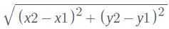
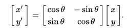
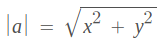
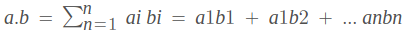
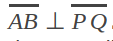
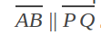
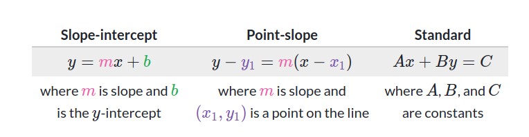
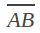
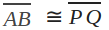
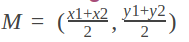

# List of Computational Geometry Sup topic's Resources, Tags, Terminologies and Explanations

Table of Contents
=================

- [Resources And Approximate Time](#resources-and-approximate-time)
- [Tags](#tags)
- [Sup Topic Terminologies And Explanations](#sup-topic-terminologies-and-explanations)
   * [Space](#space)
   * [Planes](#planes)
   * [Points](#points)
   * [Vectors](#vectors)
   * [Lines](#lines)
   * [Segments](#segments)
   * [Triangles](#triangles)
   * [Rectangles](#rectangles)
   * [Circles](#circles)
   * [Quadlitrals](#quadlitrals)
   * [Polygons](#polygons)

## Resources And Approximate Time

Sup Topic Name   | Resources   | Approximate stydying   & solving time
-------------| -------------   |-------------   
**Space**|[Fondation](https://math.colorado.edu/courses/CalculusIII/spaces.pdf) [Geometry Symbols](https://www.rapidtables.com/math/symbols/Geometry_Symbols.html)  | #
**Points** | [Points, lines and planes](https://www.mathopenref.com/tocs/pointstoc.html)   [Points and vectors](http://geomalgorithms.com/points_and_vectors.html) [Difference between points and vectors](https://math.stackexchange.com/questions/645672/what-is-the-difference-between-a-point-and-a-vector)  [Point Rotation](https://academo.org/demos/rotation-about-point/)| #
**Vectors**| [Vectors I](https://www.khanacademy.org/math/linear-algebra/vectors-and-spaces/vectors/v/vector-introduction-linear-algebra) [Vectors II](https://www.mathsisfun.com/algebra/vectors.html)  [Vector operations](http://hyperphysics.phy-astr.gsu.edu/hbase/vect.html) [Vectors and points](https://github.com/mostafa-saad/ArabicCompetitiveProgramming/blob/master/04%20Math/Computational%20Geometry-02-Point_and_Vector.pdf) [Vector and space](https://www.khanacademy.org/math/linear-algebra/vectors-and-spaces/dot-cross-products/v/vector-dot-product-and-vector-length) [Dot & Cross](https://math.stackexchange.com/questions/77/understanding-dot-and-cross-product)| #
**Lines**| [Angles](https://www.homeschoolmath.net/teaching/g/angles.php)| #
**Segments**| | #
**Triangles** | [Intro to Trigonometry](https://www.mathsisfun.com/algebra/trigonometry.html)| #
**Rectangles** || #
**Circles** || #
**Quadlitrals** || #
**Polygons** || #

## Tags
- Points (Euclidean Geometry Foundations)
- Lines (Euclidean Geometry Foundations)
- Triangles (Euclidean plane geometry)
- Rectangles (Euclidean plane geometry)
- Circles (Euclidean plane geometry)
- Quadlitrals (Euclidean plane geometry)
- Polygons (Euclidean plane geometry)

## Sup Topic Terminologies And Explanations

## Space
### Definitions
* **Space** is a term used to describe an infinitely large area that spans in all directions forever, and is empty unless a scenario says otherwise.
* **Euclidean space** it’s basic units are points, which we can construct from it(lines, planes and shapes), as sets of points having prescribed properties it comes in dimensions from 1 to n.
## Planes
### Definitions
* **plane** is a flat (no width at all) body inside of space. it has infinite length in every direction.
* **Euclidean plane**  Also called Euclidean geometry or synthetic geometry, is based on axioms, definitions, and theorems proved from them. It's an axiomatic theory.
* **Cartesian Plane** Is a model or method of Euclidean geometry to represent points, and defined by two perpendicular number lines: the x-axis, which is horizontal, and the y-axis, which is vertical. Using these axes, we can describe any point in the plane using an ordered pair of numbers. where each point is named by a pair of real numbers (x,y), straight lines are given by linear equations, distance by the distance formula, circles are given by particular quadratic equations, and angles by angle formulas in terms of trigonometric functions.
* **Note**  Euclidean Plane means we have only some set of axiom, Cartesian plane means Euclidean plane + One fixed method of representing points.
* **Coplanar** Objects are coplanar if they all lie in the same plane.
### Properties
* Two distinct planes are either parallel or they intersect in a line.
* A line is either parallel to a plane, intersects it at a single point, or is contained in the plane.
* Two distinct lines perpendicular to the same plane must be parallel to each other.
* Two distinct planes perpendicular to the same line must be parallel to each other.
## Points
### Definitions
* **Point** is an exact location in space, denoted by a dot and has no size, a location is where (or when) you are. * **Collinear** Points that lie on the same straight line.
### Methods & Operations
* **Euclidean distance** Is the ordinary straight-line distance between two points in Euclidean space 
* **Point rotation** to rotate the (x,y) around the origin, the coordinates of the new point would be located at (*x',*y'), where
  x′ = xcosθ − ysinθ and y′ = ycosθ + xsinθ, θ is the angle of rotation, in matrix notation:
  
### Algorithms
* **Reflection Point** 
* **Distance To Line**
  * Find the closet point but using vector instead of the normal equations
* **Distance To Line Segment**
  * If the perpendicular line point from the point is on the line segment then find normal closet point
  * If the perp point not in the line segment then the answer would be the first point or the second of the segment
* **Collinear**
* **Counter Clockwise**
 ## Vectors
### Definitions
* **Vector** is a displacement in a space, a displacement is how to get from one location to another. They have both magnitude (how far to go) and a direction (positive or negative), the first coordinate represent how much we move horizontally, and the second coordinate represent how much we moving vertically.
* **Magnitude** The magnitude of a vector written as |a|, and calculate by pythagorean theorem 
* **Scalar** A scalar has magnitude (size) only.
* **Unit Vector** Are vectors which magnitude is exactly 1 unit.
### Methods & Operations
* **Vector Addition & subtraction**
  * Vector ± Vector: A ± B = (ai ± bi)
  * Vector ± Point: P ± V = (pi ± vi)
* **Vector Multiplying by Scalar**
  * a*v= (a * vi)
* **Vector Multiplying by vector**
  * Scalar or dot product:  
  * Vector or cross product:
### Algorithms 
* **Point To Vector**
  * A vector is a line segment (thus it has two end points and length/magnitude, so if we have two points and want to convert to a vector then find the distance between them.
* **Scale Vector**
  * We can scale(change size) a vector by some value by multiplyng the vector by that scale.
* **Translate Point**
  * Change the place of the point according to a vector
* **Dot Product**
  * Computing the angle α between two vectors a and b, a⋅b=|a|⋅|b|⋅cos(α). 
     * •<0 if the angle is obtuse,
     * •>0 if the angle is acute,
     * •=0 if the a and b are orthogonal.
## Lines
### Definitions
* **Line** A geometric object that is straight, infinitely long and infinitely thin and the shortest distance between any two points, points also set of points whose coordinates satisfy a given linear equation ax + by + c = 0.
* **Ray** A portion of a line which starts at a point and goes off in a particular direction to infinity (has one end).
* **Note** Rays and lines cannot be congruent because they do not have both endpoints defined, and so have no definite length.
* **Perpendicular**  A line is perpendicular to another if it meets or crosses it at right angles (90°).
* **Intersecting lines** The point where two lines meet or cross, Two distinct lines have one intersection point unless they are parallel; in which case they have none.
* **Parallel** Lines are parallel if they are always have the same distance apart (called "equidistant"), and will never meet, parallel lines share the same slope but have different intercepts and by definition never cross, .
* **Closest point** The closet point from a line to a point.
* **Coincident lines** two lines that lie one on top of the other.
* **Vertical lines** slope is undefined
* **Horizontal lines** slope = 0
### Methods & Operations

* **Linear Equation Slope-intercept** A linear equation can be written in the form y = mx + b; m ≠ 0, m is the slope of the line and b is the y-intercept.
* **Standard form of a line** AX + BY = C; A, B, C, where A is the slope and C is y-intercept.
* **The Slope of a Line** m, represents the change in y over the change in x. Given two points, (x1, y1) and (x2, y2), this formula determines the slope of a line m = ∆y / ∆x = ( y2 − y1) / (x2 − x1),
* **Note**  Vertical lines cannot be described by such equations, however, because dividing by ∆x means dividing by zero.
* **The Point-Slope Formula**  one point and the slope, the point-slope formula will lead to the equation of a line: y − y1 = m(x − x1).
* **Compute the line equation** We can compute the line equation if we are given at least two points that pass through that line
* **Determine if a point lies in a line** substitute the values of the point  into the equation of the line y=mx+b, where m & b are known, then If the point satisfies the equation of the line (results in a true equality), then the point is on the line, If you want to know whether the point (x,y)(x,y) is "in between" the two endpoints, make sure that  x1 ≤ x≤ x2 and y1 ≤ y ≤ y2.
### Algorithms
* **Points To Line** You have two points and want to  compute the required line equation
   * Find the slope, m = ∆y / ∆x 
   * If the line is vertical then the slope is undifend, then the equation would be x = x constant, **Special case**
   * If the line is horizontal then the slope is zero, then the equation would be y = y constant
   * Put the slope and one point into the "Point-Slope Formula y - y1 = m(x - x1)
   * Simplify to get the line equation ax + by + c
      * y - y1 = mx - mx1
      * mx = y + (mx1 - y1)
      * ax = mx; a = -m
      * by = y; y = 1
      * c = mx1 - y1
* **Point To Line**
   * If we have the line slope and one point then we will compute the line equation
* **Parallel Lines**
    * Check if the have the same slope
    * Check if the don't cross
* **Same Lines** 
    * Check if the have the same slope
    * Check if they cross
    * Check if they have the same hight 
* **Intersect Lines**
   * Check if they don't have the same slope (not Parallel)
   * Check they cross on a point
   * Find that point they cross in by sloving the two linear algebraic equations togther
* **Closet Point To Line**
   * I have a point and a line and  I wanna find a point lie in that line that the closet to that point
   * If the line is vertical then the y of the closet point is the same as the line, and x = -c
   * If the line is horizontal then the x of the closet point is the same as the line, and y = -c
   * If the line is normal:
     * Draw a line from that point to the line which is perpendicular, we know the point and the slope
     * Then find the intersection of that perpendicular line and the other line and that would be the closet point
* **Two Lines Angle**
  * We can compute the angle aob given three points: a, o, and b, using dot product, Since oa · ob = |oa|×|ob| × cos(θ), we have theta = arccos(oa · ob/(|oa|×|ob|)). 
  
## Segments
### Definitions
* **Line segment** A straight line which links two points without extending beyond them (has two ends) 
* **Congruent line segments** When Two line segments have the same length 
* **Midpoint in line segments** The midpoint is halfway between the two endpoints  
### Methods & Operations
### Algorithms
* **Intersect Lines Segments**
 
## Triangles
### Definitions
### Methods & Operations
### Algorithms

## Rectangles
### Definitions
### Methods & Operations
### Algorithms

## Circles
### Definitions
### Methods & Operations
### Algorithms

## Quadlitrals
### Definitions
### Methods & Operations
### Algorithms

## Polygons
### Definitions
### Methods & Operations
### Algorithms

